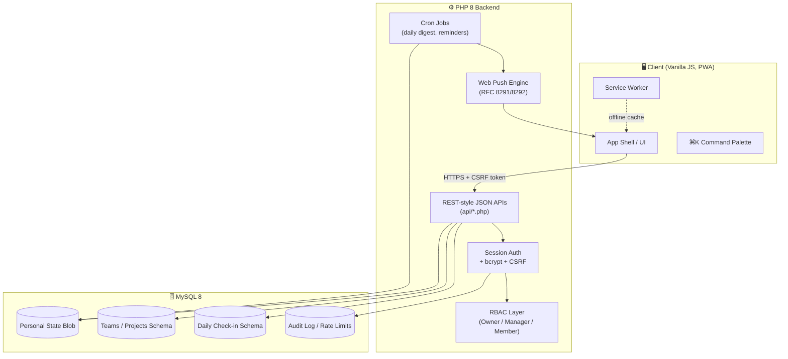

<div align="center">


# ✦ Taskvel ✦
### *कार्य, done well.*

**The task organizer that thinks like you do — and now, like your whole team.**

*A fast, focused, achingly beautiful productivity app that scales from "just me" to "the whole office" — without ever feeling like enterprise software.*

<br/>


<br/>

[Overview](#-overview) •
[Features](#-features) •
[Tech Stack](#-tech-stack) •
[Getting Started](#-getting-started) •
[Configuration](#-configuration) •
[Architecture](#-architecture) •
[Security](#-security) •
[Roles & Permissions](#-user-roles--permissions) •
[API](#-api-overview) •
[Deployment](#-deployment) •
[Roadmap](#-roadmap) •
[Contributing](#-contributing)

</div>

---

## 🌌 Overview

Most task apps make you choose: *simple but limited*, or *powerful but ugly and overwhelming*.

**Taskvel refuses the trade-off.**

It's a single, gorgeously-designed application that ranks your work intelligently, keeps you in flow with a beautiful focus timer, celebrates your wins like they matter (because they do), and — when you're ready — lets your entire team assign, track, and crush tasks together. One login. Every device. Zero friction.

This isn't a to-do list. **It's a system.**

> *"It feels like the app was designed by someone who actually hates cluttered software as much as I do."*

Taskvel ships as three composable layers, each fully optional beyond the first:

| Layer | What it's for |
|---|---|
| 🧍 **Personal App** | Smart, single-user task management with auto-ranking, focus timer, streaks, and offline PWA support |
| 👥 **Teams & Projects** | Multi-user collaboration with Kanban boards, assignment, roles, and activity logs |
| 📍 **Daily Check-in** *(optional)* | A lightweight attendance + task-reporting ritual with manager dashboards, approvals, and email notifications |

---

## 📸 Screenshots & Preview

> Add your own screenshots or a short demo GIF here to showcase the UI — a hero shot of the dashboard, the focus timer in action, and the Teams Kanban board work best. Suggested spec: `1600×1000px`, PNG or WebP, stored under `docs/screenshots/`.

<div align="center">

| Personal Dashboard | Focus Timer | Teams Kanban Board |
|:---:|:---:|:---:|
| `docs/screenshots/dashboard.png` | `docs/screenshots/focus-timer.png` | `docs/screenshots/teams-board.png` |

</div>

---

## ✨ Features

### 🧭 Personal App — everything in your pocket

<table>
<tr><td width="50%" valign="top">

**📋 Capture & Organize**
- Smart Quick-Add with natural-language parsing (`"Call the client tomorrow #urgent !high"` → tag, date & priority, auto-parsed)
- Urgency × Impact auto-ranking, with deadlines that **auto-escalate priority** as they approach
- Tags with one-tap filter chips
- Multi-step subtasks per task
- Task templates for recurring workflows
- Resource links & freeform remarks per task
- Drag-and-drop manual reordering, pin-to-top
- Bulk select → mass complete or delete

**⏱️ Focus & Flow**
- Custom Pomodoro timer with a **floating, draggable mini-timer** that never blocks your workflow
- Ambient completion chimes
- Daily focus history with a 7-day chart
- Daily task goal with a live progress bar
- Productivity Score (0–100) blended from streak, focus time & completion rate
- Fire-streak tracker for daily consistency

</td><td width="50%" valign="top">

**🗺️ See It However You Think**
- All / Today / Pending / Done smart tabs
- Eisenhower Priority Matrix view
- Weekly Review dashboard
- Time-tracked report grouped by tag
- Global search across names, notes, tags & remarks
- ⌘K command palette for power users

**🎁 Extras That Feel Premium**
- CSV, PDF, and full JSON backup exports
- One-click **.ics calendar export** (Google/Apple/Outlook)
- Snooze a deadline in one tap
- In-app notification center + daily briefing on first login
- Native OS notifications + in-app celebration overlays
- Full offline-first PWA — installs like a native app
- Onboarding carousel for new users

</td></tr>
</table>

### 🎨 Design that doesn't compromise

- **Four hand-tuned visual themes** (Mono / Indigo / Emerald / Amber) × light & dark, with living aurora backgrounds and buttery micro-animations
- 🎉 **Confetti-worthy celebrations** on task completion and finished focus blocks — a genuinely delightful moment, not a boring toast

### 🌍 True Cross-Device Sync

Start on your laptop at your desk, finish on your phone on the train. Same account, same data, always current — the Personal App uses a full-state blob sync model with a zero data-loss guarantee, so nothing you type is ever left stranded on one device.

### 👥 Teams & Shared Projects — built for the whole office

Flip a switch and Taskvel becomes a **real collaborative project tool**:

| Capability | Description |
|---|---|
| 🏢 Unlimited teams | Create as many teams as your org needs |
| 📨 Email invitations | Bring coworkers in with a single email address |
| 🎚️ Three-tier permissions | Owner → full control · Manager → create/edit/assign/delete · Member → owns assigned work |
| 📁 Multiple projects per team | Marketing, Engineering, Ops — as many boards as you need |
| 🗂️ Kanban flow | A clean Todo → In Progress → Done board everyone instantly understands |
| 🎯 Intentional assignment | Managers delegate to anyone; members can self-assign |
| 📊 Per-person progress strip | See exactly who's completed what, at a glance |
| 💬 Task-level comments | Discussion stays attached to the work, not lost in chat |
| 📜 Activity log | A running history of who did what, and when |
| 🔒 Server-enforced security | Every permission check happens in the backend, not just the UI |

**The result:** a manager can create a project, assign five tasks to five different teammates, and watch the whole thing complete in real time — from one dashboard.

### 📍 Daily Check-in *(optional "office mode")*

A third, completely optional area — separate from the personal app and Teams — for a lightweight daily attendance + task-reporting ritual.

<details>
<summary><strong>How it works</strong></summary>

<br/>

1. **Check in** for the day (one check-in per calendar date)
2. **Log tasks** as you go — each can optionally have a **"report to" email** (any email, no Taskvel account required)
3. **Start → Done** — starting a task begins a live timer; marking it done records exactly how long it took
4. The moment a task is marked done, the report-to person gets an **instant email** with the task name and time taken
5. **Check out** at day's end — Taskvel tallies everything and **emails a full daily summary** to every unique report-to address used that day
6. The on-screen summary shows the same breakdown immediately, before the page reloads

</details>

<details>
<summary><strong>Advanced Check-in: Manager Dashboard, Approvals, Breaks & Idle Detection</strong></summary>

<br/>

Run `sql/migration_06_checkin_advanced.sql` after `migration_05` to unlock:

- **Report-to at check-in** — set a default contact for the whole day
- **Task-started emails**, plus richer completion emails (start/end time, duration)
- **Approval workflow** — completed tasks move to *Awaiting approval*; the report-to person gets a one-click **Approve / Send back** link (no login required). Rejected tasks reopen automatically.
- **Break tracking** — Lunch / Tea / Personal / Other, subtracted from worked-time totals
- **Idle detection** — tab-level inactivity signal (5+ minutes without input), shown as a soft productivity signal. This is *not* screen capture — a browser genuinely can't do background screenshotting without active screen-sharing, so idle-time is the honest, privacy-respecting alternative.
- **End-of-day notes** — free-text "what I accomplished" field in the summary email

**`manager.php` — Manager Dashboard:**
- Live view of everyone reporting to your email — pending / in-progress / awaiting-approval / done
- One-click Approve/Reject
- Per-person productivity: tasks done, average completion time, total time logged
- Today / This week / This month / Custom range filters
- 7-day completion trend chart
- Flags for late check-ins, early checkouts, overtime, and overdue tasks
- CSV export for any date range

**Optional integrations:** Slack / Microsoft Teams notifications via simple Incoming Webhook URLs (`config/webhooks.php`) — no OAuth app needed.

> **Intentionally not included:** screenshot/activity capture (technically impossible to do quietly in a browser tab — would require an installed desktop agent, a fundamentally different product with its own privacy/legal implications) and deep Slack/Teams bot integrations (would need per-workspace OAuth registration — a separate project).

</details>

### 🔔 Real Push Notifications

Taskvel ships with a **complete, dependency-free Web Push implementation** (RFC 8291 + RFC 8292) — no Composer package required. Real OS-level notifications on desktop (Chrome/Edge/Firefox) and mobile (Chrome/Edge on Android; Safari on iOS 16.4+ after "Add to Home Screen"), even when Taskvel isn't open.

| Trigger | Context |
|---|---|
| Daily digest | Personal app — overdue/due-today tasks, via cron |
| Instant assignment alert | Teams — when a task is assigned to you |
| Instant completion alert | Teams — when someone completes a task you created |

---

## 🛠️ Tech Stack

```
Frontend    →  Vanilla JS — zero framework bloat, buttery-smooth CSS animations
Backend     →  PHP 8.1+ — clean REST-style JSON APIs
Database    →  MySQL 8 — relational schema for Teams & Projects
Sync Model  →  Full-state blob sync for the personal app (zero data-loss guarantee)
                + relational multi-user schema for Teams & Projects
Auth        →  Secure session-based login, bcrypt password hashing
PWA         →  Installable, offline-capable, manifest + service worker included
Push        →  Native Web Push (RFC 8291/8292), no third-party dependency
```

**No frameworks to fight. No build step. No dependency hell.** Just fast, clean code that a real developer can read top to bottom in one sitting — and that a real business can run in production today.

---

## 🚀 Getting Started

### Prerequisites

- PHP **8.1+** (required for `openssl_pkey_derive`, used in Web Push key exchange)
- MySQL 8.0+ (or MariaDB equivalent)
- A standard web server (Apache/Nginx) with `.htaccess` support recommended

### Installation

```bash
# 1. Clone the repository
git clone https://github.com/your-org/taskvel.git
cd taskvel

# 2. Import the schema, in order
mysql -u youruser -p taskvel < sql/schema.sql
mysql -u youruser -p taskvel < sql/migration_02_premium_sync.sql
mysql -u youruser -p taskvel < sql/migration_03_user_state.sql
mysql -u youruser -p taskvel < sql/migration_04_teams_projects.sql

# 3. (Optional) Daily Check-in module
mysql -u youruser -p taskvel < sql/migration_05_daily_checkin.sql
mysql -u youruser -p taskvel < sql/migration_06_checkin_advanced.sql

# 4. Security hardening (hard dependency — always run this)
mysql -u youruser -p taskvel < sql/migration_07_security.sql

# 5. Point your web server's document root at this folder
# 6. Sign up, log in, and start shipping
```

### Enabling Push Notifications (optional, one-time)

```bash
php scripts/generate_vapid_keys.php
```

Paste the two printed values into `config/vapid.php`, and set `VAPID_SUBJECT` to a `mailto:` address you control. Until these are filled in, push silently stays off and everything else in Taskvel works exactly as before.

> ⚠️ On PHP versions below 8.1, swap the internals of `includes/webpush.php`'s `send_web_push()` for the [`minishlink/web-push`](https://github.com/web-push-libs/web-push-php) Composer package — same function signature, drop-in replacement.

**Enable on a device:** open the 🔔 notifications panel and tap **"Enable push notifications on this device"**. Each browser/device gets its own subscription, so a phone and a laptop can both receive alerts independently.

**Daily digest cron** (personal app deadlines):

```bash
# crontab -e
0 8 * * *  php /path/to/taskvel-php/cron/send_reminders.php
```

---

## ⚙️ Configuration

| File | Purpose |
|---|---|
| `config/vapid.php` | Web Push VAPID key pair + subject email |
| `config/webhooks.php` | Optional `SLACK_WEBHOOK_URL` / `TEAMS_WEBHOOK_URL` for Check-in notifications |
| `config/workhours.php` | Expected check-in/checkout times and shift length, used for late/early/overtime flags |
| Environment variables | `DB_HOST`, `DB_NAME`, `DB_USER`, `DB_PASS`, SMTP credentials for outgoing email |

<details>
<summary><strong>Example environment setup</strong></summary>

<br/>

```bash
DB_HOST=localhost
DB_NAME=taskvel
DB_USER=youruser
DB_PASS=your-secure-password

SMTP_HOST=smtp.yourprovider.com
SMTP_PORT=587
SMTP_USER=notifications@yourdomain.com
SMTP_PASS=your-smtp-password

VAPID_SUBJECT=mailto:you@yourdomain.com
```

Rotate `VAPID_PRIVATE_KEY`, SMTP credentials, and `DB_PASS` through your host's secret manager rather than plain environment variables if your compliance requirements call for it.

</details>

---

## 🏗️ Architecture



**Sync model:** the Personal App uses a full-state blob sync (zero data-loss guarantee across devices), while Teams & Projects and Daily Check-in use a relational, multi-user schema with server-enforced permission checks on every request.

---

## 📁 Folder Structure

```
taskvel-php/
├── api/                        # REST-style JSON endpoints
│   ├── tasks.php
│   ├── teams.php
│   ├── projects.php
│   ├── project_tasks.php
│   ├── timer.php
│   ├── remarks.php
│   ├── attachments.php
│   └── auth.php
├── includes/                   # Shared server-side logic
│   ├── security.php             # clean_str, clean_email, csv_safe, ics_escape, etc.
│   ├── webpush.php
│   ├── webhooks.php
│   └── auth.php
├── cron/
│   └── send_reminders.php       # Daily digest job
├── scripts/
│   └── generate_vapid_keys.php
├── config/
│   ├── vapid.php
│   ├── webhooks.php
│   └── workhours.php
├── sql/
│   ├── schema.sql
│   ├── migration_02_premium_sync.sql
│   ├── migration_03_user_state.sql
│   ├── migration_04_teams_projects.sql
│   ├── migration_05_daily_checkin.sql
│   ├── migration_06_checkin_advanced.sql
│   └── migration_07_security.sql
├── js/
│   └── api-client.js            # Handles CSRF token attachment, API calls
├── checkin.php                  # Daily Check-in page
├── manager.php                  # Manager Dashboard
└── taskvel-pro.php                    # Main app entry
```

> Exact structure may vary slightly by release — this reflects the modules described in this document.

---

## 🔒 Security

Taskvel has been audited and hardened end-to-end. `sql/migration_07_security.sql` is a **hard dependency** (rate limiting and audit logging tables).

<details>
<summary><strong>🐛 Real bugs found and fixed during the audit</strong></summary>

<br/>

These were actual, exploitable issues — not hypothetical hardening:

| Issue | Fix |
|---|---|
| **Critical IDOR** in `api/tasks.php` (`GET:show`) — zero ownership check, any user could read any task by guessing its ID | Added visibility check (owner or accepted share) |
| **Client-trusted MIME type** in `api/attachments.php` | Real MIME sniffing via `finfo_file`, random server-generated filenames, `.htaccess` disabling script execution in upload folders |
| **Session-fixation gap** in `register.php` | Session ID now rotated before login, matching `api/auth.php` |
| **Missing authorization checks** in `api/timer.php` and `api/remarks.php` | Access checks now consistent across all endpoints |
| **CSV/Excel formula injection** (CWE-1236) | All exports neutralize cells starting with `= + - @` |
| **ICS calendar injection** | Task titles properly escaped per RFC 5545 |
| **Dead code** (`includes/slack.php`, pointing at a table that never existed) | Removed, superseded by `includes/webhooks.php` |

</details>

<details>
<summary><strong>✅ What's now in place</strong></summary>

<br/>

- **CSRF protection** on every state-changing request, auto-attached by `js/api-client.js` and verified server-side
- **Rate limiting** — sliding-window throttling on login (5 attempts / 15 min per email+IP), registration, uploads, invites, sync pushes, and public token endpoints. Fails *open* so availability isn't held hostage by the security layer.
- **Security headers** on every response: CSP, `X-Frame-Options: DENY`, `X-Content-Type-Options: nosniff`, `Referrer-Policy`, `Permissions-Policy`, `Cross-Origin-Opener-Policy`, HSTS over HTTPS
- **Session hardening** — `httponly` + `samesite=Lax` + conditional `secure` cookies, 2-hour idle timeout, 12-hour absolute lifetime, ID rotation every 15 minutes
- **Safe error handling** — no stack trace, SQL query, or file path ever reaches the client; everything logged server-side
- **Audit logging** (`security_audit_log`) — logins, registrations, logouts, rate-limit hits, CSRF rejections, uploads/deletes, with IP + user agent
- **Input sanitization helpers** (`clean_str`, `clean_email`, `one_of`, `csv_safe`, `ics_escape`) applied consistently, alongside (never instead of) parameterized queries
- **RBAC** enforced server-side in every Teams/Projects API call
- **Server-level hardening** — `.htaccess` blocks direct access to `config/`, `includes/`, `sql/`, `cron/`, `scripts/`
- **Least-privilege data exposure** — `current_user()` only selects the columns the UI needs; password hashes never leak into JSON

</details>

<details>
<summary><strong>📋 Still worth doing on your side</strong></summary>

<br/>

- Swap the illustrative password blocklist in `includes/auth.php` for a real dataset (e.g. Have I Been Pwned's Pwned Passwords)
- Put Taskvel behind a WAF/CDN (Cloudflare or similar) for DDoS absorption and bot filtering
- Run dependency scanning on a schedule if you add third-party libraries (currently zero runtime dependencies by design)
- Get a professional third-party penetration test before handling sensitive company data at scale
- Rotate `VAPID_PRIVATE_KEY`, SMTP credentials, and `DB_PASS` via a proper secret manager

</details>

---

## 👤 User Roles & Permissions

| Role | Create Projects | Assign Tasks | Edit Any Task | Delete Any Task | Manage Members | Own Assigned Work |
|---|:---:|:---:|:---:|:---:|:---:|:---:|
| **Owner** | ✅ | ✅ | ✅ | ✅ | ✅ | ✅ |
| **Manager** | ✅ | ✅ | ✅ | ✅ | ❌ | ✅ |
| **Member** | ❌ | Self-assign only | Own tasks only | Own tasks only | ❌ | ✅ |

Every check above is enforced **server-side** in `api/teams.php`, `api/projects.php`, and `api/project_tasks.php` — never as a hidden UI-only restriction.

---

## 🔌 API Overview

Taskvel exposes clean, REST-style JSON endpoints under `api/`. All state-changing requests require a CSRF token (auto-attached by `js/api-client.js`) and an authenticated session.

| Endpoint | Purpose |
|---|---|
| `api/auth.php` | Login, logout, registration, session management |
| `api/tasks.php` | Personal task CRUD, ownership/visibility enforced |
| `api/teams.php` | Team creation, invitations, membership |
| `api/projects.php` | Project CRUD within a team |
| `api/project_tasks.php` | Task assignment and board state within a project |
| `api/timer.php` | Focus sessions and time logs, scoped to visible tasks |
| `api/remarks.php` | Notes/remarks attached to tasks |
| `api/attachments.php` | File uploads with MIME sniffing and safe storage |

<details>
<summary><strong>Example: fetching a task</strong></summary>

<br/>

```bash
curl -X GET "https://yourdomain.com/api/tasks.php?action=show&id=42" \
  -H "Cookie: PHPSESSID=your-session-id"
```

```json
{
  "id": 42,
  "title": "Call the client",
  "due_date": "2026-07-08",
  "priority": "high",
  "tags": ["urgent"],
  "status": "pending"
}
```

</details>

---

## 💡 Usage Examples

**Smart Quick-Add:**
```
Call the client tomorrow #urgent !high
```
→ Taskvel parses this into a task titled "Call the client", due tomorrow, tagged `urgent`, priority `high` — no forms required.

**Command palette:** press `⌘K` (or `Ctrl+K`) anywhere in the app to jump to any task, view, or the Daily Check-in page instantly.

**Calendar export:** open any task or your full task list → **Export → .ics** → import directly into Google Calendar, Apple Calendar, or Outlook.

---

## 📦 Deployment

1. Provision a PHP 8.1+ / MySQL 8 environment (shared hosting, VPS, or containerized)
2. Run all `sql/` migrations in numeric order (see [Getting Started](#-getting-started))
3. Set environment variables / `config/*.php` values for DB, SMTP, VAPID, and webhooks
4. Point your web server's document root at the project folder; ensure `.htaccess` is respected (Apache) or replicate the equivalent rules in your Nginx config
5. Set up the daily digest cron job
6. Put the deployment behind HTTPS (required for Web Push and secure cookies) and, ideally, a WAF/CDN
7. Verify security headers and rate limiting are active in production before going live

---

## 🗺️ Roadmap

- [ ] Native mobile wrapper (iOS/Android) built on the existing PWA
- [ ] Deep Slack/Teams bot integration with in-channel actions
- [ ] Configurable SLA-based escalation rules for Teams tasks
- [ ] Public API tokens for third-party integrations
- [ ] Real-time updates via WebSockets for Teams boards

> Have a feature request? Open an issue — see [Contributing](#-contributing) below.

---

## 🤝 Contributing

Contributions are welcome! To propose a change:

1. Fork the repository
2. Create a feature branch (`git checkout -b feature/your-feature`)
3. Make your changes, keeping with the project's zero-framework, zero-build-step philosophy
4. Test thoroughly against a local MySQL instance with all migrations applied
5. Submit a pull request with a clear description of the change and its motivation

Please avoid introducing new runtime dependencies unless there's a strong reason — Taskvel's simplicity is a feature.

---

## 📄 License

Released under the **MIT License**. See `LICENSE` for details.

---

## 🙏 Credits & Acknowledgements

Built with a deliberate, no-framework philosophy — vanilla JS, PHP, and MySQL, chosen so any developer can read the codebase top to bottom in one sitting.

---

## 📬 Contact

Questions, bug reports, or feature requests? Open an issue on the repository, or reach out via the maintainer contact listed in the repository settings.

<div align="center">
<!-- user login 
minal@user.com
ChangeMe!123

minaladmin@user.com
 -->
<br/>

### Built for one person's flow. Ready for an entire team's grind.

**Taskvel — Focus · Rank · Ship.**

</div>