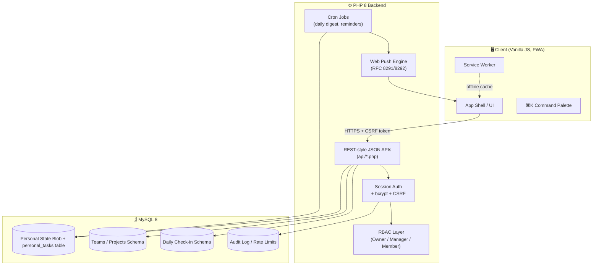

<div align="center">


# ✦ Taskvel ✦
### *कार्य, done well.*

**The task organizer that thinks like you do — and now, like your whole team.**

*A fast, focused, achingly beautiful productivity app that scales from "just me" to "the whole office" — without ever feeling like enterprise software.*

<br/>


<br/>

[Overview](#-overview) •
[Features](#-features) •
[Team Tasks & Progress Updates](#-team-tasks--progress-updates) •
[Global Search & My Work](#-global-search--my-work) •
[AI-Powered Assistance](#-ai-powered-assistance) •
[Trading Journal & P/L Dashboard](#-trading-journal--pl-dashboard) •
[Billing & Enterprise Licensing](#-billing--enterprise-licensing) •
[Every Function, Explained](#-every-function-explained) •
[Tech Stack](#-tech-stack) •
[Getting Started](#-getting-started) •
[Configuration](#-configuration) •
[Architecture](#-architecture) •
[Security](#-security) •
[Roles & Permissions](#-user-roles--permissions) •
[API](#-api-overview) •
[Deployment](#-deployment) •
[Roadmap](#-roadmap) •
[Contributing](#-contributing)

</div>

---

## 🌌 Overview

Most task apps make you choose: *simple but limited*, or *powerful but ugly and overwhelming*.

**Taskvel refuses the trade-off.**

It's a single, gorgeously-designed application that ranks your work intelligently, keeps you in flow with a beautiful focus timer, celebrates your wins like they matter (because they do), and — when you're ready — lets your entire team assign, track, and crush tasks together. One login. Every device. Zero friction.

This isn't a to-do list. **It's a system.**

Taskvel ships as four composable layers, each fully optional beyond the first:

| Layer | What it's for |
|---|---|
| 🧍 **Personal App** (`taskvel-pro.php`) | Smart, single-user task management with auto-ranking, focus timer, streaks, and offline PWA support |
| 👥 **Teams & Projects** | Multi-user collaboration with Kanban boards, direct task assignment, roles, and activity logs |
| 📍 **Daily Check-in** *(optional)* | A lightweight attendance + task-reporting ritual with manager dashboards, approvals, and email notifications |
| 💳 **Billing & Enterprise Licensing** *(optional)* | 30-day Pro trial, individual upgrade via Stripe or Razorpay (UPI intent/QR, cards, netbanking), and seat-based licensing for organizations |

---

## 📸 Screenshots & Preview

> Add your own screenshots or a short demo GIF here — a hero shot of the dashboard, the focus timer in action, and the Teams Kanban board work best. Suggested spec: `1600×1000px`, PNG or WebP, stored under `docs/screenshots/`.

<div align="center">

| Personal Dashboard | Focus Timer | Teams Kanban Board |
|:---:|:---:|:---:|
| `docs/screenshots/dashboard.png` | `docs/screenshots/focus-timer.png` | `docs/screenshots/teams-board.png` |

</div>

---

## ✨ Features

### 🧭 Personal App — everything in your pocket

<table>
<tr><td width="50%" valign="top">

**📋 Capture & Organize**
- Smart Quick-Add with natural-language parsing (`"Call the client tomorrow #urgent !high"` → tag, date & priority, auto-parsed)
- Urgency × Impact auto-ranking, with deadlines that **auto-escalate priority** as they approach
- Tags with one-tap filter chips
- Multi-step subtasks per task, each with an optional link
- Task templates for recurring workflows
- Resource links & freeform remarks per task
- Drag-and-drop manual reordering, pin-to-top
- Bulk select (right-click a card) → mass complete or delete
- **Pick-for-Today** — hand-select exactly which tasks (including old overdue ones) show up in the Today tab, instead of relying purely on auto-ranked urgency

**⏱️ Focus & Flow**
- Custom Pomodoro timer (25/5, 50/10, 15/3, or fully custom) with a **floating, draggable mini-timer** that never blocks your workflow
- Ambient completion chimes (Web Audio, no audio files)
- Daily focus history with a 7-day bar chart
- Daily task goal with a live progress bar
- Productivity Score (0–100) blended from streak, focus time & completion rate
- Fire-streak tracker for daily consistency

</td><td width="50%" valign="top">

**🗺️ See It However You Think**
- All / Today / Pending / Done smart tabs
- Eisenhower Priority Matrix view (Do First / Schedule / Quick Wins / Later)
- Weekly Review dashboard (focus minutes, tasks done, streak, top tags)
- Time-tracked report grouped by tag
- Global search across names, people, tags, steps & remarks
- ⌘K command palette for power users

**🎁 Extras That Feel Premium**
- CSV, PDF, and full JSON backup/restore exports, each filterable by status, date range, person, collaborator, and tag
- One-click **.ics calendar export** (Google/Apple/Outlook)
- Snooze a deadline by one day in one tap
- In-app notification center + daily briefing on first login each day
- Native OS notifications + full-screen celebration overlays with confetti
- Full offline-first PWA — installs like a native app
- Onboarding carousel for new users, with swipe support
- Teams · Projects · Events hub widget surfaced right on the dashboard

</td></tr>
</table>

### 🎨 Design that doesn't compromise

- **Five hand-tuned visual themes** (Samal / Mono / Indigo / Emerald / Amber) × light & dark, with living aurora backgrounds and buttery micro-animations
- 🎉 **Confetti-worthy celebrations** on task completion and finished focus blocks — a genuinely delightful moment, not a boring toast

### 🌍 True Cross-Device Sync

Start on your laptop at your desk, finish on your phone on the train. Same account, same data, always current — the Personal App uses a full-state blob sync model plus a dedicated per-task sync table, with a zero data-loss guarantee, so nothing you type is ever left stranded on one device.

### 👥 Teams & Shared Projects — built for the whole office

Flip a switch and Taskvel becomes a **real collaborative project tool**:

| Capability | Description |
|---|---|
| 🏢 User-created teams | Any user can create a team and becomes its Owner automatically — Free plan: 2 teams / 5 members per team · Pro: unlimited |
| 📨 Email invitations | Bring coworkers in with a single email address |
| 🎚️ Three-tier permissions | Owner → full control · Manager → create/edit/assign/delete · Member → owns assigned work |
| 📁 Multiple projects per team | Marketing, Engineering, Ops — as many boards as you need |
| 🗂️ Kanban flow | A clean Todo → In Progress → Done board everyone instantly understands |
| 📋 Board / List views | Toggle any project between the Kanban board and a sortable, filterable table view — search by title, filter by status/assignee/priority, sort any column, click through to the same task detail either way |
| 🎯 Intentional assignment | Managers delegate to anyone; members can self-assign |
| ✅ Direct Team Tasks | Assign a task straight to a teammate — due date, priority, status, and progress % — without needing to create a Project first (see [Team Tasks & Progress Updates](#-team-tasks--progress-updates)) |
| 📊 Per-person progress strip | See exactly who's completed what, at a glance |
| 💬 Task-level comments | Discussion stays attached to the work, not lost in chat |
| 📅 Team events | Shared events with attendees, surfaced on every member's dashboard hub |
| 📜 Activity log & full update timeline | A running history of who did what and when, plus a per-task history of every progress update (status, %, notes, attachments) |
| 🔒 Server-enforced security | Every permission check happens in the backend, not just the UI |

### ✅ Team Tasks & Progress Updates

A lighter-weight sibling to full Projects, for the common case of *"just assign this one thing to someone"* — no board setup required.

- **Assign in one step** — pick a teammate, due date, priority, and status; owners/managers can assign to anyone, members can self-assign
- **In-app + push notification** the moment a task is assigned or completed
- **Update Progress** — the assignee (or a manager) posts a status + percentage-complete update with optional notes and file attachments
- **Full history timeline** per task — every update is kept, not just the latest state, with who posted it, what changed, and any attached files
- **Email the "senior"** — the task's creator (and the team owner, if different) get notified by email when progress is posted, in addition to the in-app notification; recipients can turn the email off from Billing & Plan without losing in-app alerts

### 🔍 Global Search & 🗂️ My Work

Two things every team member needs the moment work is spread across more than one project: a way to *find* anything without remembering where it lives, and a single place to see *everything assigned to you* without checking five different pages.

| Capability | Description |
|---|---|
| ⌘K / Ctrl+K global search | Available from every page in the app (header search icon or the keyboard shortcut) — searches your personal tasks, every project task and team task across every team you belong to, plus projects and teams by name, all in one debounced, instant panel |
| 🗂️ My Work — unified task feed | One page (`my-work.php`) that merges personal tasks, project tasks, and team tasks assigned to you into a single list, bucketed the way you'd expect: **Overdue → Due today → Upcoming (7 days) → Later → No due date** |
| ✅ One-click complete from My Work | Mark anything done directly from the unified feed — updates the task in its native system (personal/project/team) immediately, with optimistic UI |
| 🔎 Filter & search within My Work | Free-text search, filter by source (Personal / Projects / Team tasks), and a show/hide-completed toggle |
| 📋 List/Table view for project boards | Any project can be viewed as a sortable, filterable table instead of the Kanban board — same task data, click any column to sort, filter by status/assignee/priority, persisted per-browser so it remembers your last choice |

None of this requires a new database migration — search and My Work read from the same `tasks`, `project_tasks`, and `team_tasks` tables everything else already uses, scoped by your existing team memberships.

### 🤖 AI-Powered Assistance

Gemini-backed AI woven into the moments where typing everything by hand is the most friction — never required, always optional, and every feature fails gracefully with a clear message if `GEMINI_API_KEY` isn't configured.

| Capability | Where | What it does |
|---|---|---|
| ✨ AI Suggest | Personal App — new task sheet | Given just a task name (+ optional note), fills in urgency, impact, a realistic deadline, a time estimate, up to 3 subtask steps, and up to 3 tags |
| 🧠 AI Quick Add | Personal App — new task sheet | Parses a single free-form sentence ("Submit GST report next Friday, very urgent") straight into a clean structured task — title, urgency, deadline, steps, and tags all inferred at once |
| 🔦 Daily Focus briefing | Personal App dashboard | A short, warm, spoken-style paragraph naming what to tackle first, generated from your current open task list |
| 📝 Workday summary | Daily Check-in — checkout report | Turns today's completed/pending tasks into a short third-person summary paragraph, inserted into the end-of-day report email |
| 📔 Journal Fix & Rephrase | Trading Journal | One click corrects spelling/grammar and lightly rephrases a trading-journal entry for clarity, while preserving the mood line and original meaning |

Every AI action shares one plan-based daily quota (`ai_consume_daily_quota()` — Free plan gets a small shared daily allowance across *all* AI features combined; Pro/Business is effectively unlimited) plus a per-feature hourly rate limit as an abuse safety net. Requests are minimized by design — e.g. the Daily Focus briefing only ever sends task name/priority/deadline, never notes or collaborators.

### 📈 Trading Journal & P/L Dashboard

A dedicated profit/loss journal for traders, living alongside the task-management core.

| Capability | Description |
|---|---|
| 🎯 Monthly goal tracking | Set a ₹ target per month; a live gauge, progress bar, and achieved/remaining stats track progress against it, with confetti when you cross 100% |
| 💰 Daily P/L entries | Log each trading day as Profit / Loss / Break-even with an amount, an optional setup tag (Breakout, Trend, Reversal, Scalp, News, Swing), and notes |
| 📊 Overview charts | Daily P/L, monthly/yearly P/L, goal vs. achieved, profit/loss distribution, win/loss percentage, and best/worst trading days |
| 📈 Analytics tab | Profit factor, expectancy, average win/loss, best win streak, max drawdown, an all-time equity curve and drawdown chart, top setups/tags by P/L, month-over-month comparison, and a weekly performance table |
| 🗓️ Calendar heatmap | Month-by-month color-coded view of daily P/L, navigable by month |
| 🧮 Risk calculator | Position size and risk-per-trade calculator from account balance, risk %, stop-loss distance, and reward:risk ratio |
| 📔 Trading journal & mood picker | A max-15-line daily journal entry with a one-tap mood picker (Confident/Calm/Neutral/Frustrated/Anxious/Tired), plus a **✨ AI Fix & Rephrase** button that corrects grammar and rephrases the entry via the shared AI integration |
| 🏅 Achievement badges | Goal Crusher, On Fire (3+ win streak), Consistent Trader, Profit Factor Pro, 5-Day Journal Streak, and 50+ Trades Logged, unlocked automatically from entry/journal history |
| ⬇️ Export & filters | CSV export and print-friendly report view, filterable by Today/Week/Month/Previous Month/Year/Custom range, with searchable, sortable entries |

> **Access model:** Trading is free to use for 10 days from your first journal entry — a separate, stricter clock than the 30-day general Pro trial. After that, the journal and calendar go **read-only**: every entry you've already logged stays fully visible, but creating or editing new entries requires an active Pro subscription. Enforced server-side (`require_trading_journal_write()` in `includes/billing.php`), not just hidden in the UI, so it can't be bypassed by calling `api/trading_journal.php` directly.

### 📍 Daily Check-in *(optional "office mode")*

A third, completely optional area — separate from the personal app and Teams — for a lightweight daily attendance + task-reporting ritual.

<details>
<summary><strong>How it works</strong></summary>

<br/>

1. **Check in** for the day (one check-in per calendar date)
2. **Log tasks** as you go — each can optionally have a **"report to" email** (any email, no Taskvel account required)
3. **Start → Done** — starting a task begins a live timer; marking it done records exactly how long it took
4. The moment a task is marked done, the report-to person gets an **instant email** with the task name and time taken
5. **Check out** at day's end — Taskvel tallies everything and **emails a full daily summary** to every unique report-to address used that day
6. The on-screen summary shows the same breakdown immediately, before the page reloads

</details>

<details>
<summary><strong>Advanced Check-in: Manager Dashboard, Approvals, Breaks & Idle Detection</strong></summary>

<br/>

Run `sql/migration_06_checkin_advanced.sql` after `migration_05` to unlock:

- **Report-to at check-in** — set a default contact for the whole day
- **Task-started emails**, plus richer completion emails (start/end time, duration)
- **Approval workflow** — completed tasks move to *Awaiting approval*; the report-to person gets a one-click **Approve / Send back** link (no login required). Rejected tasks reopen automatically.
- **Break tracking** — Lunch / Tea / Personal / Other, subtracted from worked-time totals
- **Idle detection** — tab-level inactivity signal (5+ minutes without input), shown as a soft productivity signal. This is *not* screen capture — a browser genuinely can't do background screenshotting without active screen-sharing, so idle-time is the honest, privacy-respecting alternative.
- **End-of-day notes** — free-text "what I accomplished" field in the summary email

**`manager.php` — Manager Dashboard:**
- Live view of everyone reporting to your email — pending / in-progress / awaiting-approval / done
- One-click Approve/Reject
- Per-person productivity: tasks done, average completion time, total time logged
- Today / This week / This month / Custom range filters
- 7-day completion trend chart
- Flags for late check-ins, early checkouts, overtime, and overdue tasks
- CSV export for any date range

**Optional integrations:** Slack / Microsoft Teams notifications via simple Incoming Webhook URLs (`config/webhooks.php`) — no OAuth app needed.

> **Intentionally not included:** screenshot/activity capture (technically impossible to do quietly in a browser tab) and deep Slack/Teams bot integrations (would need per-workspace OAuth registration).

</details>

### 🔔 Real Push Notifications

Taskvel ships with a **complete, dependency-free Web Push implementation** (RFC 8291 + RFC 8292) — no Composer package required. Real OS-level notifications on desktop (Chrome/Edge/Firefox) and mobile (Chrome/Edge on Android; Safari on iOS 16.4+ after "Add to Home Screen"), even when Taskvel isn't open.

| Trigger | Context |
|---|---|
| Daily digest | Personal app — overdue/due-today tasks, via cron |
| Instant assignment alert | Teams — when a task is assigned to you |
| Instant completion alert | Teams — when someone completes a task you created |

---

## 💳 Billing & Enterprise Licensing

Taskvel Pro is free to try, simple to pay for individually, and scales cleanly to a company-wide seat licensing model — all three live on one `users.plan` field, reconciled by a single `recompute_user_plan()` function so trial, personal Stripe, and org-seat access never step on each other.

### 🎁 30-day free trial

- Every new signup gets **30 days of full Taskvel Pro** automatically, starting the moment their account is created
- `billing.php` shows days remaining and the exact expiry date
- Automatic reminders at **7 days, 3 days, 1 day** before expiry, and again **on the day it ends** — both as an in-app notification and an email
- When the trial ends, the account reverts to the Free plan (2 teams, 5 members per team, 1 project per team) and `billing.php` shows a clear upgrade prompt
- Existing paid subscribers and organization-licensed accounts never enter the trial flow

### 💰 Individual upgrade

- One click on `billing.php` starts a real Stripe Checkout session for a personal Pro subscription — or, for UPI intent/QR, cards, and netbanking without a Stripe/GSTIN-registered business account, a Razorpay Subscription instead
- Two independent webhooks reconcile payment: `api/stripe-webhook.php` (sets `plan_source = 'stripe'`) and `api/razorpay-webhook.php` (sets `plan_source = 'razorpay'`) — either permanently exempts the account from the trial-expiry job

### 🏢 Enterprise seat-based licensing

For companies, HR teams, and business owners who need to license Taskvel Pro for a whole roster of employees at once:

| Capability | Description |
|---|---|
| 🎟️ Seat purchase | Any billing cycle (monthly/yearly) and any seat count, upgradeable at any time |
| 👤 Employee provisioning | Add employees by email — existing Taskvel users get their account upgraded instantly; brand-new emails get an account auto-created with a secure temporary password |
| 📧 Onboarding emails | New accounts receive login email + temp password + a reminder to change it; existing users get a simple "you've been added" notice |
| 📊 Seat dashboard | Total purchased, assigned, and available seats; billing cycle; renewal date; subscription status; recent invites — all on `billing.php` |
| ⏸️ Suspend / reactivate | Pull someone's Pro access without losing their data or freeing their seat, then bring them back with one click |
| 🔁 Transfer seats | Move a seat from one employee straight to another, atomically |
| 🗑️ Remove members | Frees the seat immediately for reassignment |
| 🔐 Owner/Admin-only | Only an organization's Owner or Admins can purchase, assign, suspend, or remove seats — enforced server-side |
| 📜 Full audit trail | Every seat assignment, suspension, removal, and transfer is recorded in the security audit log |
| 🔒 Transactional & oversell-proof | Seat assignment locks the organization row for the duration of the operation, so concurrent invites can never exceed purchased seats |

> **Scope note:** CSV bulk import, SCIM provisioning, SSO, multi-organization membership, and department-wise seat allocation are intentionally not built yet — the schema (`organizations` / `organization_members`) is designed so none of them require a rewrite when you're ready to add them.

---


Everything below lives in `taskvel-pro.php`'s inline script and reflects the actual, current codebase — grouped the way the code itself is organized, so this doubles as a map for anyone reading the source top to bottom.

### State & persistence

| Function | What it does |
|---|---|
| `load()` | Reads tasks, remarks, focus minutes, notifications, focus log, streak data, and daily goal from `localStorage`, and back-fills any field missing from older saved tasks (tags, recur, collab, order, links, `selectedForToday`) without ever destroying existing data. |
| `save()` / `saveR()` / `saveF()` / `saveNotif()` / `saveFLog()` / `saveStreak()` | Each persists its own slice of state to `localStorage` and schedules a debounced push to the server. |
| `migrateLegacyKeys()` | One-time migration from old, non-namespaced `localStorage` keys to per-user-namespaced keys (`taskvel_u{ID}_*`), so switching accounts on the same device never leaks data between users. |
| `touch(t)` | Stamps a task with `updatedAt = Date.now()` — the timestamp every conflict-resolution and merge function relies on to decide which copy of a task is newer. |
| `mergeById(localArr, serverArr)` | Generic last-write-wins merge by `id`, comparing `updatedAt`, used for remarks and other synced collections. |
| `gatherState()` | Bundles everything *except* tasks (remarks, notifications, focus log, streak, templates, daily goal, theme, accent) into one JSON blob for server sync. |

### Cross-device sync

| Function | What it does |
|---|---|
| `schedulePush()` / `flushPendingPush()` / `pushStateNow()` | Debounce, force-flush, and actually perform the push of `gatherState()` to the server, versioned to detect conflicts. Flushing happens immediately on tab backgrounding or `pagehide` so nothing is lost if the debounce timer never fires. |
| `resolveConflict()` | On a version conflict, pulls the server's copy, merges remarks and focus logs non-destructively, then re-pushes. |
| `pullStateFromServer()` | Pulls the shared state blob and repaints every affected part of the UI (remarks, notifications, focus log, streak, goal, theme, accent). |
| `taskApiPayload(t)` | Shapes a single task into the exact JSON contract the `personal_tasks` API table expects. |
| `upsertTaskOnServer(t)` / `deleteTaskOnServer(id)` | Create/update or delete one task server-side, independent of the shared-state blob (tasks live in their own table for finer-grained sync). |
| `loadTasksFromServer()` | Pulls every task from the server and merges by `updatedAt`, so a brand-new device with empty `localStorage` still gets the full task list. |
| `logoutUser()` | Flushes any pending sync, logs out server-side, wipes every `taskvel_*` key from `localStorage`, and redirects to login — so the next person on the same browser starts clean. |

### Streaks, goals & scoring

| Function | What it does |
|---|---|
| `recordActivity()` | Bumps the daily streak counter once per calendar day, resets it if a day is missed, and automatically celebrates productivity milestones at 7, 30, 100, and 365 consecutive days. |
| `tasksCompletedToday()` | Counts tasks completed today, used by the goal bar and the productivity score. |
| `computeProductivityScore()` | Blends completion rate (40%), streak length (30%), and today's focus minutes (30%) into one 0–100 number. |
| `renderGoalBar()` / `setDailyGoal()` / `checkDailyGoal()` | Render the "N / goal tasks" progress strip, let the user change their daily target, and fire a one-time celebration the first time the goal is hit each day. |
| `score(u, d)` / `rank(s)` / `effRank(t)` / `wasEsc(t)` | Core ranking engine: `score` multiplies urgency × impact weights; `rank` buckets the numeric score into critical/high/medium/low; `effRank` additionally escalates that rank as a deadline approaches; `wasEsc` reports whether escalation actually changed the displayed rank (drives the "Auto-escalated" banner on a card). |

### Today, tabs & filtering

| Function | What it does |
|---|---|
| `getTodayList()` | Powers the **Today** tab: if you've hand-picked any task via "+ Today", it shows *only* your picks (regardless of rank, including overdue ones); if nothing is picked, it falls back to the automatic critical/high-priority view. |
| `toggleToday(id)` | Adds/removes a task from your manual "Today" selection and persists + syncs the change. |
| `getFiltered()` | The master list builder behind every tab — applies the active tab, tag filter, and search query together. |
| `setFilter(f)` / `renderTabs()` | Switch between All / Today / Pending / Done / Matrix / Weekly Review / Remarks / Time Report, and keep each tab's live count badge accurate. |
| `toggleTagFilter(t)` / `renderTagRow()` / `allTags()` | Drive the horizontal tag-chip filter row above the task list. |

### Task lifecycle

| Function | What it does |
|---|---|
| `addTask()` | Validates the add form, runs `smartParseTask()` on the raw title, applies any detected tags/urgency/deadline the user didn't set explicitly, then creates and syncs the new task. |
| `smartParseTask(raw)` | The natural-language engine: strips `#tags`, urgency keywords (`!critical`/`urgent`/`high`/`medium`/`low`), and relative dates (`today`, `tomorrow`, `next monday`, `in 3 days`) out of the typed title and returns them as structured fields. |
| `openEdit(id)` / `saveEdit()` / `closeEdit()` | Open the edit sheet pre-filled with a task's current fields (including steps, links, tags), save all changes back, and close the sheet. |
| `toggleStep(id, i)` / `completeTask(t)` | Toggle one subtask; if every subtask becomes done, auto-completes the parent task, fires the celebration, and (if recurring) spawns the next occurrence. |
| `markDone(id)` / `markUndone(id)` | Manually complete or reopen a task. Completing a task now includes a temporary **Undo** action, clears its "Today" selection, records streak activity, checks the daily goal, and syncs the change across devices. |
| `snoozeTask(id)` | Pushes a task's deadline forward by exactly one day. |
| `delTask(id)` | Removes a task with a smooth exit animation and a 4.5-second **Undo** toast that fully restores the task and its remarks if tapped. |
| `togglePin(id)` | Pins/unpins a task to the top of its list. |
| `duplicateTask(id)` | Instantly creates a copy of an existing task, including subtasks, while resetting completion status and tracking fields. |
| `clearCompleted()` | Removes all completed tasks and their related remarks in a single action, with automatic server synchronization. |
| `copyTaskText(id)` *(optional)* | Copies a task, checklist, and due date as plain text for quick sharing. |
| `flash(id)` | Brief highlight animation used after completing or restoring a task. |
| `startTimeTracking(id)` / `stopTimeTracking(id)` | Start/stop a live stopwatch on a task, accumulating into `timeSpent` used by the Time Report tab. |

### Bulk actions

| Function | What it does |
|---|---|
| `enterBulkMode(firstId)` / `toggleBulkSelect(id)` / `exitBulkMode()` / `updateBulkBar()` | Right-click any card to enter multi-select mode, toggle additional cards, and show a floating action bar. |
| `bulkDone()` / `bulkDelete()` | Mark every selected task done, or delete them all at once, then sync each change to the server. |

### Recurrence

| Function | What it does |
|---|---|
| `nextDate(dateStr, recur)` | Computes the next daily/weekly/monthly date from a base date. |
| `spawnRecurrence(t)` | When a recurring task is completed, clones it (steps reset, new deadline) into a fresh open task and notifies the user. |
| `parseRecurrence(rule, fromDateStr)` | A lightweight `RRULE:`-style parser (FREQ/INTERVAL/BYDAY) for more advanced recurrence patterns beyond the simple daily/weekly/monthly presets. |

### Tags, links & templates

| Function | What it does |
|---|---|
| `normalizeTag(t)` | Lowercases, trims, and length-caps a tag before it's stored, keeping the tag list consistent. |
| `addTagToForm()` / `addTagToEditForm()` / `renderFormTags()` / `renderEditFormTags()` / `removeFormTag(i)` / `removeEditFormTag(i)` | Manage the tag-pill inputs on the add and edit sheets. |
| `addLinkToEditForm()` / `renderEditLinks()` / `removeEditLink(i)` | Manage resource links (label + URL) attached to a task from the edit sheet. |
| `saveAsTemplate()` / `renderTemplates()` / `useTemplate(id)` / `deleteTemplate(id)` | Save any task's shape (urgency, impact, tags, recurrence, steps) as a reusable template, then spin up new tasks from it in one click. |

### Remarks

| Function | What it does |
|---|---|
| `openRemark(id)` / `closeRemark()` / `addRemark()` / `delRemark(id)` | Attach freeform notes to a specific task (or a general remark not tied to any task) and manage them from the dedicated Remarks tab. |
| `renderRemarks()` | Renders the full remarks list as its own view, most recent first. |

### Views: Matrix, Weekly Review, Time Report

| Function | What it does |
|---|---|
| `renderMatrix()` | Builds the Eisenhower-style 2×2 (Do First / Schedule / Quick Wins / Later) from urgency + impact. |
| `renderWeeklyReview()` | Summarizes the last 7 days: total focus minutes, tasks completed, current streak, and top tags used. |
| `renderTimeReport()` | Aggregates tracked time per tag from every task's `timeSpent`. |
| `formatTime(ms)` | Converts milliseconds into a human "Xd Yh" / "Xh Ym" / "Xm" string, shared by the time report and task cards. |

### Rendering & drag-and-drop

| Function | What it does |
|---|---|
| `cardHTML(t, idx)` | Builds the full HTML for a single task card — badges, deadline pill, escalation banner, tags, links, steps, progress bar, remarks, and the action row (Done, +Today, Focus, Track/Stop, Snooze, Edit, Remark, Remove). Shared by the live list and the filtered PDF-export view. |
| `renderTaskCardsInto(container, taskArr)` | Renders an arbitrary task array into any container — used both for `#list` and for the temporary filtered view during PDF export. |
| `render()` | The main repaint: updates the stat tiles, greeting, tag row, goal bar, empty/onboarding states, and re-sorts + re-renders the visible task list (pinned → not-done → rank → manual order or score). |
| `progressClass(t)` | Colour-codes a task's progress bar red/yellow/green based on urgency, deadline proximity, and completion percentage. |
| `dragStart/Over/Leave/Drop/End` | Full HTML5 drag-and-drop reordering, active only in the default "All" view with no filters, persisting the new order both locally and via `/api/personal_tasks.php?action=reorder`. |
| `cardMove(e, el)` | Tracks cursor position over a card to drive the subtle radial-glow hover effect. |

### Focus timer (Pomodoro)

| Function | What it does |
|---|---|
| `paintTimer()` / `paintMiniTimer()` | Repaint the main ring timer and the floating draggable mini-timer pill in lockstep. |
| `tick()` | Runs every 250ms while active: credits focus minutes in real time, and on reaching zero, flips between Focus and Break, chimes, notifies, and shows a celebration. |
| `toggleTimer()` / `resetTimer()` / `cycleMode()` | Start/pause, reset, and cycle through 25/5, 50/10, 15/3, and Custom modes. |
| `openCustomTimer()` / `closeCustomTimer()` / `saveCustomTimer()` | Configure and persist a custom focus/break length. |
| `setFocusTask(id)` | Attaches the timer to a specific task and auto-starts it. |
| `miniTimerClick/Toggle/Stop` + drag handlers | Let the floating mini-timer be clicked (scrolls back to the full timer), paused/resumed, stopped, or dragged anywhere on screen — all without leaving whatever else you're doing in the app. |
| `toggleMute()` / `isMuted()` / `chime()` | Lets users mute or unmute completion sounds, remembers the preference locally, and generates a lightweight Web Audio completion chime when enabled. |

### Notifications & briefing

| Function | What it does |
|---|---|
| `pushNotification(icon, msg)` / `renderNotifPanel()` / `markNotifsSeen()` / `updateNotifDot()` | Maintain the in-app notification center and its unread-indicator dot. |
| `sweepDeadlines()` | Runs on load and hourly, generating "due today / due tomorrow / overdue" notifications for open tasks. |
| `maybeShowBriefing()` / `dismissBriefing()` | Shows a once-per-day modal summarizing overdue/due-today/urgent tasks and streak status on first load. |
| `notifyOS(title, body)` | Fires a native browser `Notification`, requesting permission lazily on first real use rather than on page load. |
| `enablePushNotifications()` / `refreshPushButtonState()` | Opt a device into real Web Push (works even with Taskvel closed), and reflect existing subscription state when the panel opens. |

### Celebrations

| Function | What it does |
|---|---|
| `showCelebration(icon, title, sub, autoDismissMs)` / `dismissCelebration()` | Full-screen, unmissable completion modal (used for both focus-session and task completions) — deliberately not a toast, since toasts auto-vanish and can be missed. |
| `fireConfetti()` | A dependency-free canvas confetti burst themed to the active accent colour. |
| `celebrateTaskDone(taskName)` | Picks a random encouraging message and triggers both the on-screen celebration and an OS notification. |

### Export & backup

| Function | What it does |
|---|---|
| `populateExportFilters()` / `getExportDateBounds()` / `onDateRangeChange()` / `getExportFilteredTasks()` / `updateExportSummary()` | Build and apply the export panel's filters — status, date range (today/yesterday/last 7/30/custom), person, collaborator, and tag — with a live "Exporting N of M tasks" summary. |
| `exportCSV()` | Downloads a CSV of the filtered tasks, with formula-injection protection (`csvEscape`) for cells starting with `= + - @`. |
| `exportPDF()` | Opens the browser print dialog against either the live list or a temporarily-swapped filtered view, then restores the normal view afterward. |
| `exportICS()` | Downloads an RFC 5545 calendar file of every filtered task with a deadline, properly escaped (`icsEscape`), ready to import into Google/Apple/Outlook Calendar. |
| `backupData()` / `restoreData(e)` | Full JSON export of every piece of local state, and a matching restore-from-file flow with validation. |

### Onboarding

| Function | What it does |
|---|---|
| `renderOnboardDots()` / `paintOnboardSlide()` / `goToOnboardSlide()` / `onboardNext()` / `onboardBack()` | Drive the 4-slide onboarding carousel shown only to brand-new accounts with zero tasks. |
| `skipOnboarding()` / `finishOnboarding()` | Dismiss the carousel (and remember that choice), or finish it straight into the add-task sheet. |
| `initOnboardSwipe()` | Adds touch-swipe navigation between onboarding slides on mobile. |

### Command palette & keyboard

| Function | What it does |
|---|---|
| `openCmdk()` / `closeCmdk()` / `filterCmdk()` / `renderCmdkResults()` / `runCmdk(i)` | The `⌘K` / `Ctrl+K` command palette — fuzzy-filters and runs any of ~20 registered actions (add task, toggle theme, exports, jump to any tab, open Teams/Check-in/Manager pages, and more). |
| Global `keydown` handler | Implements `N` new task, `/` search, `T` toggle theme, `Space` start/pause timer, `↑/↓` keyboard task navigation, `D` mark focused task done, `Delete/Backspace` remove focused task, `Enter` open focused task, `?` shortcut cheat-sheet, and `Esc` to close anything open. |
| `kbMove(dir)` / `kbAction(action)` / `kbGetCards()` | Support keyboard-only navigation and actions across the visible task list. |

### Theme & appearance

| Function | What it does |
|---|---|
| `toggleTheme()` / `applyThemeIcon()` | Switch light/dark and keep the header icon and the mobile browser's `theme-color` meta tag in sync. |
| `setAccent(name)` / `markActiveSwatch()` | Switch between the five colour themes (Samal, Mono, Indigo, Emerald, Amber) and reflect the active choice in the picker panel. |

### Panels & misc UI

| Function | What it does |
|---|---|
| `togglePanel(id)` / `closePanel(id)` / `closeAllPanels()` | Manage the header's dropdown panels (theme, notifications, focus history, export, templates) so only one is open at a time. |
| `tickClock()` / `setGreeting()` | Keep the live header clock ticking every second, and refresh the time-of-day greeting with an open-task count. |
| `renderHistory()` / `last7Days()` | Build the 7-day focus-minutes bar chart and today/week/average totals shown in the Focus History panel. |
| `toast(msg, actionLabel, cb, dur)` / `toastAction()` | The shared bottom toast system, optionally with an action button (e.g. **Undo**). |
| Teams · Projects · Events hub (`toggleTeamHub`, `loadHub`) | Fetches and renders the user's teams and upcoming team events directly into the personal dashboard, so team activity never requires leaving the page. |

### Initialization

| Function | What it does |
|---|---|
| `init()` | The boot sequence: loads local state, renders everything, starts the clock and deadline sweep, pulls the latest server state, registers the periodic 20-second sync poll and visibility-change re-sync, and registers the service worker for offline/PWA support. |

---

## 🛠️ Tech Stack

```
Frontend    →  Vanilla JS — zero framework bloat, buttery-smooth CSS animations
Backend     →  PHP 8.1+ — clean REST-style JSON APIs
Database    →  MySQL 8 — relational schema for Teams & Projects
Sync Model  →  Full-state blob sync for shared personal state (zero data-loss guarantee)
                + a dedicated per-task table (`personal_tasks`) for finer-grained task sync
                + relational multi-user schema for Teams & Projects
Auth        →  Secure session-based login, bcrypt password hashing
PWA         →  Installable, offline-capable, manifest + service worker included
Push        →  Native Web Push (RFC 8291/8292), no third-party dependency
```

**No frameworks to fight. No build step. No dependency hell.** Just fast, clean code that a real developer can read top to bottom in one sitting — and that a real business can run in production today.

---

## 🚀 Getting Started

### Prerequisites

- PHP **8.1+** (required for `openssl_pkey_derive`, used in Web Push key exchange)
- MySQL 8.0+ (or MariaDB equivalent)
- A standard web server (Apache/Nginx) with `.htaccess` support recommended

### Installation

```bash
# 1. Clone the repository
git clone https://github.com/your-org/taskvel.git
cd taskvel

# 2. Import the schema, in order
mysql -u youruser -p taskvel < sql/schema.sql
mysql -u youruser -p taskvel < sql/migration_02_premium_sync.sql
mysql -u youruser -p taskvel < sql/migration_03_user_state.sql
mysql -u youruser -p taskvel < sql/migration_04_teams_projects.sql

# 3. (Optional) Daily Check-in module
mysql -u youruser -p taskvel < sql/migration_05_daily_checkin.sql
mysql -u youruser -p taskvel < sql/migration_06_checkin_advanced.sql

# 4. Security hardening (hard dependency — always run this)
mysql -u youruser -p taskvel < sql/migration_07_security.sql

# 5. Team-level billing plan/seat limits (per-team plan_limits table)
mysql -u youruser -p taskvel < sql/migration_08_billing.sql

# 6. Team Tasks — direct task assignment inside a Team, without needing a Project first
mysql -u youruser -p taskvel < sql/migration_09_team_tasks.sql

# 7. Per-user plan limits (Free: 2 teams / 5 members · Pro: unlimited)
mysql -u youruser -p taskvel < sql/migration_10_user_plan_limits.sql

# 8. Team Events — events with team members as attendees (Teams page + Pro hub)
mysql -u youruser -p taskvel < sql/migration_11_team_events.sql

# 9. Task Updates — full progress-update history/timeline + attachments on Team Tasks
mysql -u youruser -p taskvel < sql/migration_12_task_updates.sql

# 10. 30-day trial + Enterprise seat-based licensing (organizations, seats, billing history)
mysql -u youruser -p taskvel < sql/migration_13_trial_and_orgs.sql

# 11. Point your web server's document root at this folder
# 12. Sign up, log in, and start shipping
```

### Enabling Push Notifications (optional, one-time)

```bash
php scripts/generate_vapid_keys.php
```

Paste the two printed values into `config/vapid.php`, and set `VAPID_SUBJECT` to a `mailto:` address you control. Until these are filled in, push silently stays off and everything else in Taskvel works exactly as before.

> ⚠️ On PHP versions below 8.1, swap the internals of `includes/webpush.php`'s `send_web_push()` for the [`minishlink/web-push`](https://github.com/web-push-libs/web-push-php) Composer package — same function signature, drop-in replacement.

**Enable on a device:** open the 🔔 notifications panel and tap **"Enable push notifications on this device"**. Each browser/device gets its own subscription, so a phone and a laptop can both receive alerts independently.

**Daily digest cron** (personal app deadlines):

```bash
# crontab -e
0 8 * * *  php /path/to/taskvel-php/cron/send_reminders.php
```

**Trial reminder cron** (7/3/1-day-before and on-expiry trial notices):

```bash
# crontab -e
0 8 * * *  php /path/to/taskvel-php/cron/send_trial_reminders.php
```

---

### Enabling Stripe billing (optional, one-time)

Taskvel's Stripe integration (`includes/stripe_client.php`, `api/billing.php`, `api/stripe-webhook.php`) is **dependency-free by design** — it talks to Stripe's REST API directly over `curl`, the same zero-dependency philosophy as the rest of the codebase. **You do not need to install anything to make it work.**

If you'd rather use Stripe's official SDK instead (e.g. for typed responses or easier future maintenance), it's a drop-in swap:

```bash
composer require stripe/stripe-php
```

Then set the following environment variables (get the price IDs from your Stripe Dashboard → Products):


```

Point your Stripe webhook endpoint at `https://yourdomain.com/api/stripe-webhook.php` and subscribe it to at least `checkout.session.completed` and `customer.subscription.deleted`. Until `STRIPE_SECRET_KEY` is set, the "Upgrade to Pro" and "add seats" buttons fail gracefully with a clear "Stripe is not configured yet" message instead of erroring — every other Taskvel feature works exactly as before.


### Enabling Razorpay billing (optional, one-time)

Taskvel's Razorpay integration (`includes/razorpay_client.php`, `api/razorpay-webhook.php`) is also **dependency-free** — plain `curl` against Razorpay's REST API, same philosophy as the Stripe client. It runs alongside Stripe rather than replacing it, so `billing.php` offers both as payment options and each subscriber's `plan_source` (`'stripe'` vs `'razorpay'`) tracks which one they're actually on.

Set the following environment variables (get the Key ID/Secret from Razorpay Dashboard → Settings → API Keys):

```bash
RAZORPAY_KEY_ID=rzp_test_...
RAZORPAY_KEY_SECRET=...
RAZORPAY_WEBHOOK_SECRET=...
```

Point a Razorpay webhook at `https://yourdomain.com/api/razorpay-webhook.php` and subscribe it to: `subscription.authenticated`, `subscription.activated`, `subscription.charged`, `subscription.cancelled`, `subscription.completed`, `subscription.halted`, and `payment.failed`. Until `RAZORPAY_KEY_ID`/`RAZORPAY_KEY_SECRET` are set, the "Pay with UPI" buttons fail gracefully with a clear "Razorpay is not configured yet" message — every other Taskvel feature, including Stripe billing, works exactly as before.

> Razorpay's UPI Autopay mandates are capped by NPCI at 30 years' validity — `config/razorpay.php`'s `RAZORPAY_TOTAL_CYCLES_MONTHLY`/`RAZORPAY_TOTAL_CYCLES_YEARLY` are set to exactly that ceiling (360 / 30 cycles) so subscription creation doesn't fail with `expire_at cannot be more than 30 years for upi`.


## ⚙️ Configuration

| File | Purpose |
|---|---|
| `config/vapid.php` | Web Push VAPID key pair + subject email |
| `config/webhooks.php` | Optional `SLACK_WEBHOOK_URL` / `TEAMS_WEBHOOK_URL` for Check-in notifications |
| `config/workhours.php` | Expected check-in/checkout times and shift length, used for late/early/overtime flags |
| `config/stripe.php` | `STRIPE_SECRET_KEY`, `STRIPE_WEBHOOK_SECRET`, Pro/org-seat price IDs, `APP_BASE_URL` — see [Enabling Stripe billing](#-getting-started) |
| Environment variables | `DB_HOST`, `DB_NAME`, `DB_USER`, `DB_PASS`, SMTP credentials for outgoing email |

<details>
<summary><strong>Example environment setup</strong></summary>

<br/>

```bash
DB_HOST=localhost
DB_NAME=taskvel
DB_USER=youruser
DB_PASS=your-secure-password

SMTP_HOST=smtp.yourprovider.com
SMTP_PORT=587
SMTP_USER=notifications@yourdomain.com
SMTP_PASS=your-smtp-password

VAPID_SUBJECT=mailto:you@yourdomain.com

# Optional — only needed once you enable Stripe billing (see Getting Started)
STRIPE_SECRET_KEY=sk_test_...
STRIPE_WEBHOOK_SECRET=whsec_...
STRIPE_PRICE_PRO=price_...
STRIPE_PRICE_ORG_SEAT_MONTHLY=price_...
STRIPE_PRICE_ORG_SEAT_YEARLY=price_...
APP_BASE_URL=https://yourdomain.com

# Optional — only needed once you enable Razorpay billing (see Getting Started)
RAZORPAY_KEY_ID=rzp_test_...
RAZORPAY_KEY_SECRET=...
RAZORPAY_WEBHOOK_SECRET=...
```

Rotate `VAPID_PRIVATE_KEY`, SMTP credentials, `STRIPE_SECRET_KEY`, and `DB_PASS` through your host's secret manager rather than plain environment variables if your compliance requirements call for it.

</details>

---

## 🏗️ Architecture


```mermaid
flowchart TB
    subgraph Client["🖥️ Client (Vanilla JS, PWA)"]
        UI[App Shell / UI]
        SW[Service Worker]
        CMD["⌘K Command Palette"]
    end

    subgraph Server["⚙️ PHP 8 Backend"]
        API["REST-style JSON APIs<br/>(api/*.php)"]
        AUTH["Session Auth<br/>+ bcrypt + CSRF"]
        RBAC["RBAC Layer<br/>(Owner / Manager / Member)"]
        PUSH["Web Push Engine<br/>(RFC 8291/8292)"]
        CRON["Cron Jobs<br/>(daily digest, reminders)"]
    end

    subgraph Data["🗄️ MySQL 8"]
        PERSONAL[(Personal State Blob + personal_tasks table)]
        TEAMS[(Teams / Projects Schema)]
        CHECKIN[(Daily Check-in Schema)]
        SECURITY[(Audit Log / Rate Limits)]
    end

    UI -->|HTTPS + CSRF token| API
    SW -.->|offline cache| UI
    API --> AUTH --> RBAC
    API --> PERSONAL
    API --> TEAMS
    API --> CHECKIN
    AUTH --> SECURITY
    PUSH --> UI
    CRON --> PUSH
    CRON --> PERSONAL
```

**Sync model:** the Personal App uses a full-state blob sync for shared state (remarks, notifications, focus log, streak, templates, theme) plus a dedicated `personal_tasks` table for per-task sync — both with a zero data-loss guarantee across devices. Teams & Projects and Daily Check-in use a relational, multi-user schema with server-enforced permission checks on every request.

---

## 📁 Folder Structure

```
taskvel-php/
├── api/                        # REST-style JSON endpoints
│   ├── personal_tasks.php       # Per-user task CRUD + reorder
│   ├── teams.php
│   ├── team_tasks.php           # Direct team task assignment + progress updates + history
│   ├── team_events.php
│   ├── projects.php
│   ├── project_tasks.php
│   ├── timer.php
│   ├── remarks.php
│   ├── attachments.php           # Personal-task + team-task attachments
│   ├── ai_suggest.php            # AI Suggest — urgency/impact/deadline/estimate/steps/tags for a task
│   ├── ai_focus.php              # AI daily focus briefing
│   ├── ai_parse_task.php         # AI Quick Add — parses a free-form sentence into a structured task
│   ├── trading_journal.php       # Trading Journal — goals, entries, journal, AI fix/rephrase
│   ├── organizations.php         # Enterprise seat licensing — create/invite/suspend/remove/transfer
│   ├── billing.php               # Personal trial status + Stripe/Razorpay checkout+subscription creation
│   ├── stripe-webhook.php        # Public — reconciles Stripe payments (team/user/org)
│   ├── razorpay-webhook.php      # Public — reconciles Razorpay subscriptions (user/org)
│   ├── settings.php              # VAPID key, push subscribe, device touch, notification prefs
│   └── auth.php
├── includes/                   # Shared server-side logic
│   ├── security.php             # clean_str, clean_email, csv_safe, ics_escape, etc.
│   ├── webpush.php
│   ├── webhooks.php
│   ├── notifications.php        # create_notification() — shared in-app notification helper
│   ├── team_task_updates.php    # Progress-update recipient resolution + notify (in-app + email)
│   ├── ai.php                   # Gemini integration — suggest/focus/parse/workday-summary/journal-fix
│   ├── billing.php               # team_plan()/user_plan(), plan_limits(), seat/team-count guards
│   ├── licensing.php              # Organization seat assignment, recompute_user_plan(), temp passwords
│   ├── stripe_client.php          # Minimal curl-based Stripe Checkout Session client (no SDK)
│   ├── razorpay_client.php        # Minimal curl-based Razorpay Plan/Subscription client (no SDK)
│   ├── mailer.php
│   ├── pro-shell.php              # Shared header/nav/design tokens for Teams & Billing pages
│   └── auth.php
├── cron/
│   ├── send_reminders.php       # Daily digest job (personal app deadlines)
│   └── send_trial_reminders.php # 7/3/1-day-before + on-expiry trial notices
├── scripts/
│   └── generate_vapid_keys.php
├── config/
│   ├── vapid.php
│   ├── webhooks.php
│   ├── workhours.php
│   ├── stripe.php                # STRIPE_SECRET_KEY, price IDs, APP_BASE_URL
│   └── razorpay.php              # RAZORPAY_KEY_ID/SECRET, price IDs, UPI Autopay cycle limits
├── sql/
│   ├── schema.sql
│   ├── migration_02_premium_sync.sql
│   ├── migration_03_user_state.sql
│   ├── migration_04_teams_projects.sql
│   ├── migration_05_daily_checkin.sql
│   ├── migration_06_checkin_advanced.sql
│   ├── migration_07_security.sql
│   ├── migration_08_billing.sql          # Team-level plan/seat limits
│   ├── migration_09_team_tasks.sql       # Team Tasks + generalized notifications
│   ├── migration_10_user_plan_limits.sql # Free: 2 teams/5 members · Pro: unlimited
│   ├── migration_11_team_events.sql
│   ├── migration_12_task_updates.sql     # Progress-update history + generalized attachments
│   ├── migration_13_trial_and_orgs.sql   # Trial fields + organizations/seats/billing history
│   └── migration_20_razorpay.sql         # Razorpay ids on users/organizations + plan cache tables
├── js/
│   └── api-client.js            # Handles CSRF token attachment, API calls, file uploads
├── checkin.php                  # Daily Check-in page
├── manager.php                  # Manager Dashboard
├── teams.php                    # Teams directory
├── trading-journal.php          # Trading Journal & P/L Dashboard page
├── team.php                     # Single team / Kanban board / Team Tasks
├── billing.php                  # Personal trial status + organization dashboard
└── taskvel-pro.php               # Main personal app entry
```

> Exact structure may vary slightly by release — this reflects the modules described in this document.

---

## 🔒 Security

Taskvel has been audited and hardened end-to-end. `sql/migration_07_security.sql` is a **hard dependency** (rate limiting and audit logging tables).

<details>
<summary><strong>🐛 Real bugs found and fixed during the audit</strong></summary>

<br/>

These were actual, exploitable issues — not hypothetical hardening:

| Issue | Fix |
|---|---|
| **Critical IDOR** in `api/tasks.php` (`GET:show`) — zero ownership check, any user could read any task by guessing its ID | Added visibility check (owner or accepted share) |
| **Client-trusted MIME type** in `api/attachments.php` | Real MIME sniffing via `finfo_file`, random server-generated filenames, `.htaccess` disabling script execution in upload folders |
| **Session-fixation gap** in `register.php` | Session ID now rotated before login, matching `api/auth.php` |
| **Missing authorization checks** in `api/timer.php` and `api/remarks.php` | Access checks now consistent across all endpoints |
| **CSV/Excel formula injection** (CWE-1236) | All exports neutralize cells starting with `= + - @` |
| **ICS calendar injection** | Task titles properly escaped per RFC 5545 |
| **Dead code** (`includes/slack.php`, pointing at a table that never existed) | Removed, superseded by `includes/webhooks.php` |

</details>

<details>
<summary><strong>✅ What's now in place</strong></summary>

<br/>

- **CSRF protection** on every state-changing request, auto-attached by `js/api-client.js` and verified server-side
- **Rate limiting** — sliding-window throttling on login (5 attempts / 15 min per email+IP), registration, uploads, invites, sync pushes, and public token endpoints. Fails *open* so availability isn't held hostage by the security layer.
- **Security headers** on every response: CSP, `X-Frame-Options: DENY`, `X-Content-Type-Options: nosniff`, `Referrer-Policy`, `Permissions-Policy`, `Cross-Origin-Opener-Policy`, HSTS over HTTPS
- **Session hardening** — `httponly` + `samesite=Lax` + conditional `secure` cookies, 2-hour idle timeout, 12-hour absolute lifetime, ID rotation every 15 minutes
- **Safe error handling** — no stack trace, SQL query, or file path ever reaches the client; everything logged server-side
- **Audit logging** (`security_audit_log`) — logins, registrations, logouts, rate-limit hits, CSRF rejections, uploads/deletes, with IP + user agent
- **Input sanitization helpers** (`clean_str`, `clean_email`, `one_of`, `csv_safe`, `ics_escape`) applied consistently, alongside (never instead of) parameterized queries
- **RBAC** enforced server-side in every Teams/Projects API call
- **Server-level hardening** — `.htaccess` blocks direct access to `config/`, `includes/`, `sql/`, `cron/`, `scripts/`
- **Least-privilege data exposure** — `current_user()` only selects the columns the UI needs; password hashes never leak into JSON
- **CSV/Excel formula injection protection** on the client too — `csvEscape()` in `taskvel-pro.php` neutralizes cells starting with `= + - @` before the file is even downloaded

</details>

<details>
<summary><strong>📋 Still worth doing on your side</strong></summary>

<br/>

- Swap the illustrative password blocklist in `includes/auth.php` for a real dataset (e.g. Have I Been Pwned's Pwned Passwords)
- Put Taskvel behind a WAF/CDN (Cloudflare or similar) for DDoS absorption and bot filtering
- Run dependency scanning on a schedule if you add third-party libraries (currently zero runtime dependencies by design)
- Get a professional third-party penetration test before handling sensitive company data at scale
- Rotate `VAPID_PRIVATE_KEY`, SMTP credentials, and `DB_PASS` via a proper secret manager

</details>

---

## 👤 User Roles & Permissions

| Role | Create Projects | Assign Tasks | Edit Any Task | Delete Any Task | Manage Members | Own Assigned Work |
|---|:---:|:---:|:---:|:---:|:---:|:---:|
| **Owner** | ✅ | ✅ | ✅ | ✅ | ✅ | ✅ |
| **Manager** | ✅ | ✅ | ✅ | ✅ | ❌ | ✅ |
| **Member** | ❌ | Self-assign only | Own tasks only | Own tasks only | ❌ | ✅ |

Every check above is enforced **server-side** in `api/teams.php`, `api/projects.php`, and `api/project_tasks.php` — never as a hidden UI-only restriction.

---

## 🔌 API Overview

Taskvel exposes clean, REST-style JSON endpoints under `api/`. All state-changing requests require a CSRF token (auto-attached by `js/api-client.js`) and an authenticated session.

| Endpoint | Purpose |
|---|---|
| `api/auth.php` | Login, logout, registration, session management |
| `api/personal_tasks.php` | Personal task list/upsert/delete/reorder, ownership enforced |
| `api/teams.php` | Team creation (with plan-based limits), invitations, membership, roles |
| `api/team_tasks.php` | Direct team task assignment, progress updates, and full update history/timeline |
| `api/team_events.php` | Team event creation and the "all upcoming events across my teams" feed used by the dashboard hub |
| `api/projects.php` | Project CRUD within a team |
| `api/project_tasks.php` | Task assignment and board state within a project |
| `api/timer.php` | Focus sessions and time logs, scoped to visible tasks |
| `api/remarks.php` | Notes/remarks attached to tasks |
| `api/attachments.php` | File uploads (personal tasks and team-task progress updates) with MIME sniffing and safe storage |
| `api/ai_suggest.php` | AI Suggest — urgency/impact/deadline/estimate/steps/tags for a task name |
| `api/ai_focus.php` | AI daily focus briefing from the user's open task list |
| `api/ai_parse_task.php` | AI Quick Add — parses one free-form sentence into a structured task |
| `api/trading_journal.php` | Trading Journal — goals, daily P/L entries, journal entries, and AI fix/rephrase |
| `api/organizations.php` | Enterprise seat licensing — create org, dashboard, invite/remove/suspend/reactivate/transfer seats, billing history |
| `api/billing.php` | Personal trial/plan status, Stripe Checkout session creation, and Razorpay Subscription creation (individual + org seats + business bundle) |
| `api/stripe-webhook.php` | Public — reconciles completed Stripe payments and cancellations across teams, individuals, and organizations |
| `api/razorpay-webhook.php` | Public — reconciles Razorpay subscription activation, renewals, cancellations, and failed charges across individuals and organizations |
| `api/settings.php` | VAPID public key, push subscription registration, device touch/last-seen, notification preferences |

<details>
<summary><strong>Example: fetching a task</strong></summary>

<br/>

```bash
curl -X GET "https://yourdomain.com/api/personal_tasks.php?action=list" \
  -H "Cookie: PHPSESSID=your-session-id"
```

```json
{
  "tasks": [
    {
      "id": 1721994000000,
      "name": "Call the client",
      "deadline": "2026-07-29",
      "urgency": "high",
      "damage": "moderate",
      "rank": "high",
      "score": 6,
      "tags": ["urgent"],
      "done": false,
      "selectedForToday": true
    }
  ]
}
```

</details>

---

## 💡 Usage Examples

**Smart Quick-Add:**
```
Call the client tomorrow #urgent !high
```
→ Taskvel parses this into a task titled "Call the client", due tomorrow, tagged `urgent`, priority `high` — no forms required.

**Pick exactly what's on today's plate:** tap **"+ Today"** on any task — including an old, overdue one — and the **Today** tab switches to showing only your hand-picked tasks instead of the automatic urgent-tasks view.

**Command palette:** press `⌘K` (or `Ctrl+K`) anywhere in the app to jump to any task, view, or the Daily Check-in page instantly.

**Calendar export:** open any task or your full task list → **Export → .ics** → import directly into Google Calendar, Apple Calendar, or Outlook.

---

## 📦 Deployment

1. Provision a PHP 8.1+ / MySQL 8 environment (shared hosting, VPS, or containerized)
2. Run all `sql/` migrations in numeric order (see [Getting Started](#-getting-started))
3. Set environment variables / `config/*.php` values for DB, SMTP, VAPID, and webhooks
4. Point your web server's document root at the project folder; ensure `.htaccess` is respected (Apache) or replicate the equivalent rules in your Nginx config
5. Set up the daily digest cron job
6. Put the deployment behind HTTPS (required for Web Push and secure cookies) and, ideally, a WAF/CDN
7. Verify security headers and rate limiting are active in production before going live

---

## 🗺️ Roadmap

- [ ] Native mobile wrapper (iOS/Android) built on the existing PWA
- [ ] Deep Slack/Teams bot integration with in-channel actions
- [ ] Configurable SLA-based escalation rules for Teams tasks
- [ ] Public API tokens for third-party integrations
- [ ] Real-time updates via WebSockets for Teams boards
- [ ] Bulk CSV import for organization employee provisioning
- [ ] SCIM user provisioning and Enterprise SSO
- [ ] Multiple organizations per user; department-wise seat allocation
- [ ] Role-based and team-based licensing beyond Owner/Admin/Employee

> Have a feature request? Open an issue — see [Contributing](#-contributing) below.

---

## 🤝 Contributing

Contributions are welcome! To propose a change:

1. Fork the repository
2. Create a feature branch (`git checkout -b feature/your-feature`)
3. Make your changes, keeping with the project's zero-framework, zero-build-step philosophy
4. Test thoroughly against a local MySQL instance with all migrations applied
5. Submit a pull request with a clear description of the change and its motivation

Please avoid introducing new runtime dependencies unless there's a strong reason — Taskvel's simplicity is a feature.

---

## 📄 License

Released under the **MIT License**. See `LICENSE` for details.

---

## 🙏 Credits & Acknowledgements

Built with a deliberate, no-framework philosophy — vanilla JS, PHP, and MySQL, chosen so any developer can read the codebase top to bottom in one sitting.

---

## 📬 Contact

Questions, bug reports, or feature requests? Open an issue on the repository, or reach out via the maintainer contact listed in the repository settings.

<div align="center">

<br/>

### Built for one person's flow. Ready for an entire team's grind.

**Taskvel — Focus · Rank · Ship.**

</div>